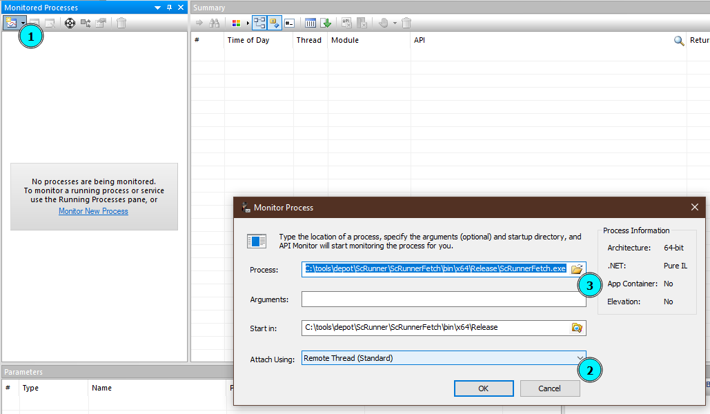
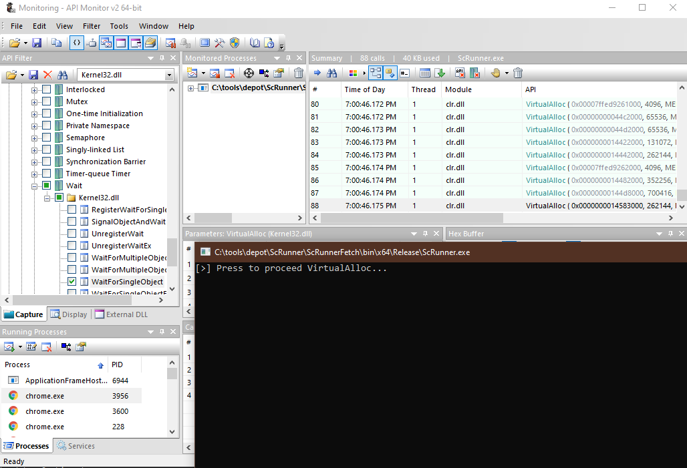

# How to DInvoke

## TLDR

Introduction into converting a C# PInvoke shellcode runner to a DInvoke shellcode runner. Also covered- using API Monitor v2 to hook Win32 API calls, writing a new D/Invoke delegate, and investigating detections of Defender and Sophos EDR against the PInvoke and DInvoke versions of the runner. 

## Background

C# can be used to execute shellcode to launch your implant via access to the Win32 API. Primarily this is done using PInvoke. As AV/EDR has upped their game, the Win32 API functions commonly used to write, inject, and execute threads or processes are increasingly hooked (think Man-In-The-Middle) to catch and stop malware. The DInvoke project can aid in bypassing the hooks to aid in evading defense mechanisms. This topic has been extensively covered and more background or details can be found in many other places. A short, solid list of resources follows.

## Resources

1. [github.com/TheWover/DInvoke](https://github.com/TheWover/DInvoke)
2. [Syscalls with D/InvokeDefeating EDR's using D/Invoke - RastaMouse](https://offensivedefence.co.uk/posts/dinvoke-syscalls/)
3. [Defeating EDR's using D/Invoke - NVISO](https://www.youtube.com/watch?v=d_Z_WV9fp9Q)
4. [Dynamic Invocation in .NET to bypass hooks - NVISO](https://blog.nviso.eu/2020/11/20/dynamic-invocation-in-net-to-bypass-hooks/)
5. [Lets Create An EDR… And Bypass It! Part 1 - ethicalchaos](https://ethicalchaos.dev/2020/05/27/lets-create-an-edr-and-bypass-it-part-1/)
6. [Lets Create An EDR… And Bypass It! Part 2 - ethicalchaos](https://ethicalchaos.dev/2020/06/14/lets-create-an-edr-and-bypass-it-part-2/)

## Goals

The goals for this exercise are as follows:

1. How to monitor Win32 API calls
2. Using DInvoke in your project
3. Convert a basic shellcode runner using PInvoke to DInvoke

## The Runner 

To keep complexity low, a very basic shellcode runner will be used. The execution of the shellcode is performed as follows.

### Simple Shellcode Runner Execution

```csharp
byte[] buf = new byte[] {};

int size = buf.Length;

IntPtr addr = VirtualAlloc(IntPtr.Zero, (uint)size, 0x3000, 0x40);

Marshal.Copy(buf, 0, addr, size);

IntPtr hThread = CreateThread(IntPtr.Zero, 0, addr, IntPtr.Zero, 0, IntPtr.Zero);

WaitForSingleObject(hThread, 0xFFFFFFFF);
```

The program simply allocates space for the buffer, writes the buffer, creates a thread pointing to the buffer, and starts its execution. 

### Win32 API Access via PInvoke 

The functions listed above can be accessed in C# after importing them using the Platform Invocation Services, a la PInvoke. The code to import the functions is as follows.

```csharp
[DllImport("kernel32.dll", SetLastError = true, ExactSpelling = true)]
static extern IntPtr VirtualAlloc(IntPtr lpAddress, uint dwSize, uint flAllocationType, uint flProtect);

[DllImport("kernel32.dll")]
static extern IntPtr CreateThread(IntPtr lpThreadAttributes, uint dwStackSize, IntPtr lpStartAddress, IntPtr lpParameter, uint dwCreationFlags, IntPtr lpThreadId);

[DllImport("kernel32.dll")]
static extern UInt32 WaitForSingleObject(IntPtr hHandle, UInt32 dwMilliseconds);
```

## How to Monitor Win32 API Calls

First, install [API Monitor v2](http://www.rohitab.com/downloads) from Rohitab Labs and launch the program. 


### Monitor a program

To begin monitoring a new program, perform the following.

1. In the Monitored Process pane, select the Monitor New Process button
2. In the Monitor Process window, set the 'Attach Using' field to 'Remote Thread'
3. In the 'Process' field, browse to the desired executable



### Filter

After selecting the executable, the program will be launched. Initially, the 2 panes to work with are the 'API Filter' pane and the 'Summary' pane. If no filters are set, the Summary will be empty. Filters can be cast wide, or specific methods can be monitored. As a lot of information will fly across the Summary pane, things can be made easier/cleaner by both narrowing the filters and adding prompts to the source code. 

Example prompt.

```csharp
Console.WriteLine("[>] Press to proceed VirtualAlloc...");
var name = Console.ReadLine();
IntPtr addr = VirtualAlloc(IntPtr.Zero, (uint)size, 0x3000, 0x40);
```

The prompt will pause the program's execution until the ReadLine() function receives input. This can be helpful to hone in on information shown in the Summary pane. 

To cast a wide monitor, for example, set the 'API Filter' module to 'ntdll.dll', 'kernel32.dll', etc. 


To hone in on specific methods, the filter tree can be expanded to list singular functions.

1. In the 'API Filter' pane, use the module drop-down to select the desired library
2. In the 'API Filter' pane, select the binoculars button
3. In the 'Find' popup window, input the desired function name
4. In the 'API Filter' pane, select the checkbox for the desired function


## Observe

After configuring the filter to monitor the Win32 API functions used in the runner, the following functions will be monitored. 

1. VirtualAlloc (kernel32.dll)
2. CreateThread (kernel32.dll)
3. WaitForSingleObject (kernel32.dll)

As can be seen in the following screenshot, even with only 3 functions monitored and before the runner even gets to the first function there are 88 rows in the Summary pane.



Leveraging the program's prompts, we can note or select the last row in the Summary, switch back to the cmd terminal, and hit enter. Before arriving at the next prompt, 2 new rows are shown in the Summary.


In this case, it is easy to determine which is the call from our program as only one of the 2 calls marks the space with 'execute' permissions.


### Filter for Syscalls

With the currently set filters, only kernel32.dll APIs are monitored. As the goal is to avoid these calls and instead jump directly to the underlying syscall version, a filter can be added to monitor the 'NT Native' APIs from ntdll.dll.

The following screenshot demonstrates the ability to observe the syscall method behind `VirtualAlloc`. As shown, the `VirtualAlloc` API in kernel32.dll then calls the `NtVirtualAlloc` API in ntdll.dll. This is the function to target with DInvoke.


## DInvoke Targets

We can use API Monitor to step through our program and note each of the APIs to target using DInvoke.

### VirtualAlloc

Execution of VirtualAlloc has underlying dependency calling `NtAllocateVirtualMemory`. The `Nt*` indicates `ntdll.dll`. All exported ntdll functions begin with `Nt*`.


### CreateThread

The `CreateThread` API from kernel32.dll will be calling `NtCreateThreadEx` from ntdll.dll.


An interesting note here, the `Ex` portion of `NtCreateThreadEx` indicates an external thread. However, while `NtCreateThread`, intended for creating a thread in the local process, exists, the arguments passed to `NtCreateThreadEx` mean the function can handle both local and external processes. 

### WaitForSingleObject

The `WaitForSingleObject` API from kernel32.dll will be calling the `NtWaitForSingleObject` API from ntdll.dll.


#### Target Recap

The functions used that access the Win32 API are as follows.

- `VirtualAlloc` resides in `kernel32.dll`, calls `NtAllocateVirtualMemory` under the hood
- `CreateThread` resides in `kernel32.dll`, calls `NtCreateThreadEx` under the hood
- `WaitForSingleObject` resides in `kernel32.dll`, calls `NtWaitForSingleObject` under the hood

## Using DInvoke

In order to leverage the DInvoke tool, we first need to get it into our project. This can be done in a number of ways and depends on levels of effort, evasion aim, etc. 

### NuGet

Possibly the simplest method is to add the Nuget package in Visual Studio. This entails right-clicking the project in the Solution Explorer pane, selecting 'Manage NuGet Packages', selecting the Browse tab, searching for "DInvoke", and installing it. The downside to this method is high detection rate. 


### Reference

Next up, we can compile the library ourselves and add it as a reference to our runner project. First, clone the **dev** branch. The main branch has not been pushed to since Oct 2020. 

```bash
git clone --branch dev https://github.com/TheWover/DInvoke/ DInvoke-dev
```

Open the solution in Visual Studio, use the Solution Configurations drop-down to set the solution to Release and the Solution Platform drop-down to your desired platform, such as x64, and build the solution.


Back in the runner solution, right-click on 'References' in the Solution Explorer, select 'Add Reference', select 'Browse' in the left-hand pane, browse to and select the the compiled DInvoke.dll.


This method may slightly increase evasion as the library is not the NuGet version and was custom compiled. The source code for DInvoke can also be obfuscated to increase evasion further. The downside to this method is the requirement to carry the DInvoke.dll with the runner or use something like [dnMerge](https://github.com/CCob/dnMerge) or [Costura](https://github.com/Fody/Costura) to produce a single file for delivery.

### Embed DInvoke

Finally, a third method to include and leverage DInvoke within your project is to include the code base or portions of the code base in your project. This can include opening Explorer, browsing to the DInvoke directory, dragging it into the Visual Studio Solution Explorer, copying the required code directly from the DInvoke tool directly into the runner's code base, or leveraging something like [reprobate](https://github.com/FuzzySecurity/Sharp-Suite#reprobate) to be a plug-and-play for your C# projects. 

In this case, we'll copy the DInvoke code base into the runner solution.


Note, dropping DInvoke code base into the runner project and compiling without modification to the code does not pass disk analysis. 


## Execution with DInvoke

DInvoke can call APIs in various ways, including:

1. Standard (PInvoke)
2. Manual Mapping
3. Overload Mapping
4. Direct Syscall

In this case, we'll leverage direct syscalls.
